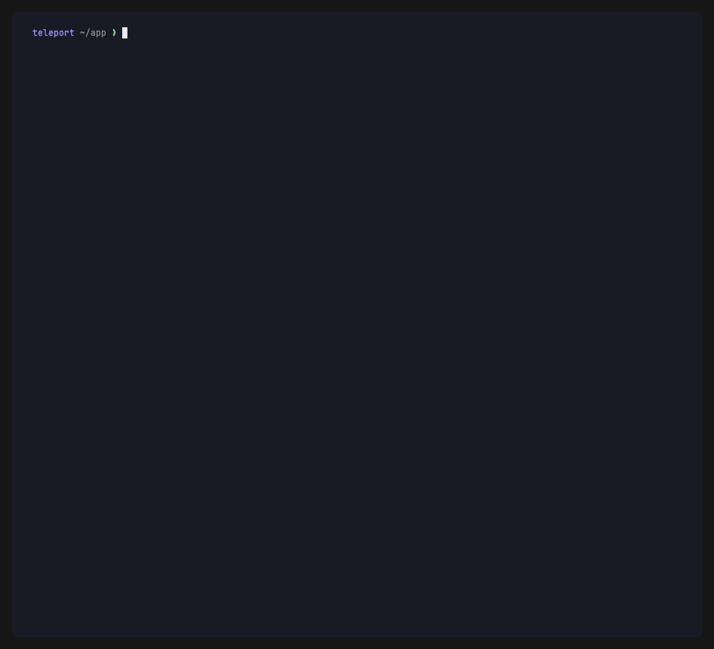
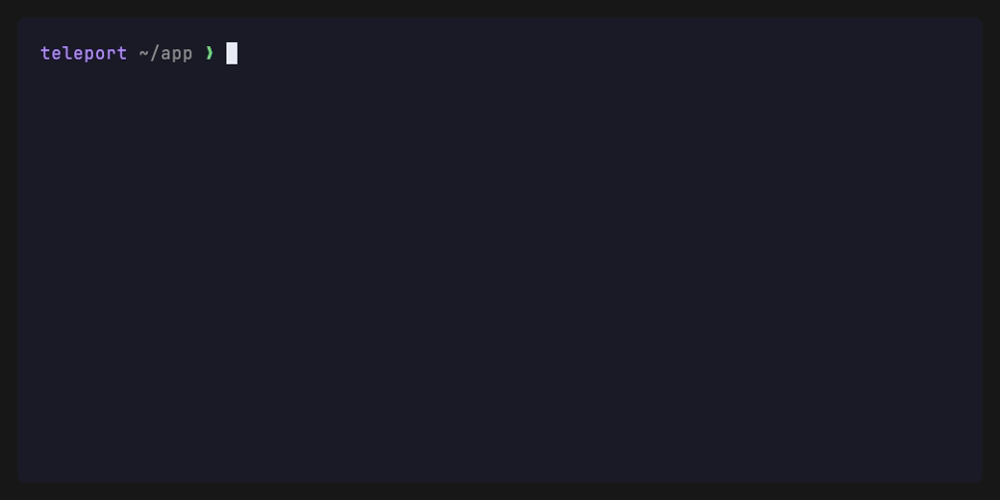

# teleport

CLI tool that syncs git-tracked files to a remote server via SSH/SFTP before
you commit — for developers who iterate on remote machines (staging servers,
VPS, homelab) and want to test live without polluting git history.

```
teleport init      # one-time profile setup (host + remote path)
teleport sync      # upload changed files → iterate → commit clean
```

<p align="center">
  
</p>

> The GIFs below are simulations recorded with [VHS](https://github.com/charmbracelet/vhs) —
> all hosts, paths, and files are invented (no real data). See [`demo/`](demo/) to regenerate them.

## How it works

1. `teleport init` — interactive TUI: pick an SSH host from `~/.ssh/config`,
   browse the remote filesystem, save a named profile.
2. Make local code changes.
3. `teleport sync` — uploads files changed since last commit (`git diff HEAD`)
   with a live progress bar. Add `-u` to include untracked files too.
4. Iterate until satisfied, then commit cleanly.

## Two ways to ship code

- **`sync`** — pushes your *working-tree* changes (everything modified since
  `HEAD`). Fast, dirty, throwaway: perfect for the edit-test-edit loop.
- **`beam`** — pushes *selected commits*, cherry-pick style. You pick which
  commits (and which files within them) land on the remote, and teleport
  remembers what was already sent per profile. Use it to promote reviewed,
  committed work to a server without pushing your whole branch.

## Commands

| Command | Description |
|---|---|
| `teleport init` | Interactive profile setup (host picker → remote dir browser). `-p <name>` presets the profile name |
| `teleport sync [profile]` | Upload changed tracked files. `-u` also includes untracked files |
| `teleport beam [profile]` | Send selected local commits to the remote (cherry-pick style) |
| `teleport status [profile]` | Compare local files against the remote by SHA256. `-p` checks only unpushed commits + dirty working tree |
| `teleport clean [profile]` | Discard dirty changes on the remote (`git checkout` + `git clean`). `-y` skips the prompt, `-x` also removes gitignored files |
| `teleport pull [profile]` | Download remote changes back to the local working tree |
| `teleport ship [bin]` | Deploy a local binary to its OS-matching bin profile |
| `teleport shell [profile]` | Open an interactive shell on the remote, already in the profile's path |
| `teleport profiles` | List configured profiles (`*` marks the local default) |
| `teleport profiles remove <name>` | Remove a profile from the global config |
| `teleport config get/set/unset <key>` | Manage per-directory defaults |
| `teleport version` | Print version, commit hash, and build date |

Most commands take an optional `[profile]` argument to override the local
default for that run. `-v`/`--verbose` works on every command.

### Root shorthands

For the common actions you don't need to type the subcommand:

| Shorthand | Equivalent |
|---|---|
| `teleport -s` | `teleport sync` |
| `teleport -su` | `teleport sync -u` |
| `teleport -i` | `teleport init` |
| `teleport -p` | `teleport profiles` |
| `teleport -b` | `teleport beam` |
| `teleport -ba` | `teleport beam --auto` |

The `beam` subcommand keeps its own flags (`--branch`, `--clean`,
`--then-sync`, `--yes`) — use the full `teleport beam …` form for those.

## Every command in action

<details>
<summary><b>init</b> — configure a profile (host picker → remote dir browser)</summary>
<p align="center"></p>
</details>

<details open>
<summary><b>sync</b> — upload working-tree changes with a live progress bar</summary>
<p align="center"></p>
</details>

<details>
<summary><b>status</b> — compare local files against the remote by SHA256</summary>
<p align="center"></p>
</details>

<details>
<summary><b>clean</b> — discard dirty changes on the remote (with confirmation)</summary>
<p align="center"></p>
</details>

<details>
<summary><b>pull</b> — download remote changes back to the working tree</summary>
<p align="center"></p>
</details>

<details>
<summary><b>profiles</b> — list configured profiles (<code>*</code> marks the default)</summary>
<p align="center"></p>
</details>

<details>
<summary><b>config</b> — per-directory defaults and last-sync overview</summary>
<p align="center"></p>
</details>

<details>
<summary><b>version</b> / <b>--help</b></summary>
<p align="center"></p>
<p align="center"></p>
</details>

## Beam — send selected commits

`teleport beam` walks you from commits → files → upload:

<p align="center">
  
</p>

1. **Commit picker** — lists local commits ahead of the remote. Commits already
   beamed to this profile show a green sent badge (`󰗠`) and a dimmed subject;
   the picker opens with only the not-yet-sent commits pre-selected. `tab`
   toggles, `a` toggles all, `u` re-selects exactly the unsent set.
2. **File picker** — files from the selected commits, grouped and color-coded by
   commit (`󰆧 [shortSHA]`). Filter to one commit at a time with `←`/`→`. Before
   sending, preview any file in place: `v` opens the full file and `d` opens the
   diff that commit introduced, both in a `bat`-style pager with syntax
   highlighting (the diff is rendered delta-style — highlighted code with a
   two-column line-number gutter). Inside the viewer `tab` switches file ⇄ diff,
   `j/k`/`↑↓`/`ctrl+d`/`ctrl+u`/`g`/`G` scroll, and `esc` returns to the picker.
3. **Send view** — upload progress grouped by commit: each commit is a colored
   header with its short SHA and subject, its files listed underneath marked
   `✓` uploaded / `✗` failed / `·` pending.

teleport tracks "sent" **per destination profile** (a commit beamed to
`production` is still unsent for `staging`) and persists it in the per-project
local config. A commit counts as sent only when every path it touched uploaded
without error; SHAs that are no longer ahead of the remote (pushed, merged, or
rebased) are pruned automatically.

Useful flags:

```sh
teleport beam --auto        # -a: skip the commit picker, auto-select unsent commits
teleport beam --branch dev  # -b: beam commits from a branch other than the current one
teleport beam --clean       # -c: run clean on the remote before beaming
teleport beam --then-sync   # -s: after beaming, sync working-tree changes on top
teleport beam --yes         # -y: skip the clean confirmation prompt (use with -c)
teleport beam -cs           # clean remote → beam commits → sync working tree
```

## Ship — deploy a binary

`teleport ship [bin]` uploads a built binary to a remote `bin/` directory in
three steps (SFTP upload to `/tmp` → `chmod +x` → `mv` into place, with
automatic `sudo` escalation when needed). The target OS is auto-detected from
the binary's magic bytes (ELF → linux, Mach-O → macos, PE → windows).

<p align="center">
  
</p>

```sh
teleport ship ./bin/mycli       # explicit binary
teleport ship                   # reads bin-dir; auto-picks the only file or prompts
teleport ship --os linux        # override OS detection
teleport ship --to ~/.local/bin # override the remote bin dir for this run
teleport ship --name mycli      # rename the binary on the remote
```

## Shell — jump onto the remote

`teleport shell [profile]` drops you into an interactive shell on the remote,
already `cd`'d into the profile's remote path — handy when you need to tail logs
or restart a service on the box you've been syncing to. No extra setup: it
reuses the host and path from the sync profile.

<p align="center">
  
</p>

```sh
teleport shell           # uses the local default profile
teleport shell staging   # use a specific profile
```

It runs `ssh -t <host> "cd <path> && exec zsh"` and **replaces its own process**
with the system `ssh` binary, so the session behaves and performs exactly like a
hand-typed `ssh` (native TTY, colors, agent, `~/.ssh/config`) and no teleport
process lingers while you're connected. The host is resolved by `ssh` itself
from `~/.ssh/config`.

## Installation

**Requirements:** Go 1.25+, a terminal with a [Nerd Font](https://www.nerdfonts.com/) installed.

```sh
git clone https://github.com/Cerebellum-ITM/teleport
cd teleport
make build       # builds ./bin/teleport and copies to ~/.local/bin
```

For cross-platform release binaries:

```sh
make build_release   # darwin_arm64, darwin_amd64, linux_amd64, linux_arm64 → ./bin/
```

## SSH authentication

Teleport reads `~/.ssh/config` for host resolution (Hostname, User, Port).
Authentication uses ssh-agent (`SSH_AUTH_SOCK`) when available, otherwise falls
back to default key files (`id_ed25519`, `id_rsa`, `id_ecdsa`). When
`IdentityFile` is set in `~/.ssh/config`, only that key is offered to avoid
exhausting `MaxAuthTries`.

If no agent is running and no key file is found, teleport falls back to a masked
password prompt — every command that connects to a remote will ask for the SSH
password instead of aborting.

## Configuration

- Global profiles: `~/.config/teleport/config.toml`
- Local project default: `~/.config/teleport/projects/<sha256-of-cwd>.toml`

No config files are placed inside your project directories.

Per-directory defaults (managed with `teleport config`):

| Key | Type | Default | Meaning |
|---|---|---|---|
| `default-profile` | string | — | Profile used when none is passed |
| `sync-untracked` | bool | `false` | Include untracked files on every sync (same as `-u`) |
| `bin-dir` | string | `<unset>` | Local dir where built binaries live (used by `teleport ship`) |

```sh
teleport config set sync-untracked true   # remember -u for this directory
teleport config get                        # print all local config values
teleport config unset bin-dir              # reset a key to its default
```

## Tech stack

Built with the [Charm](https://charm.sh/) v2 TUI stack:
[Bubbletea](https://github.com/charmbracelet/bubbletea) ·
[Bubbles](https://github.com/charmbracelet/bubbles) ·
[Lipgloss](https://github.com/charmbracelet/lipgloss) ·
[Huh](https://github.com/charmbracelet/huh) · SFTP via
[pkg/sftp](https://github.com/pkg/sftp).
