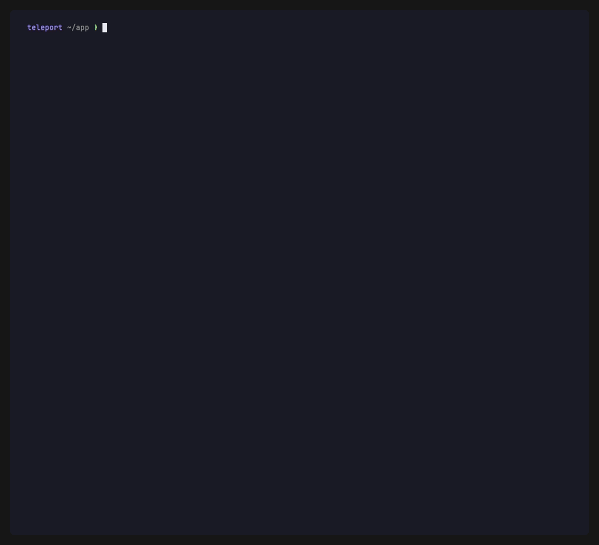
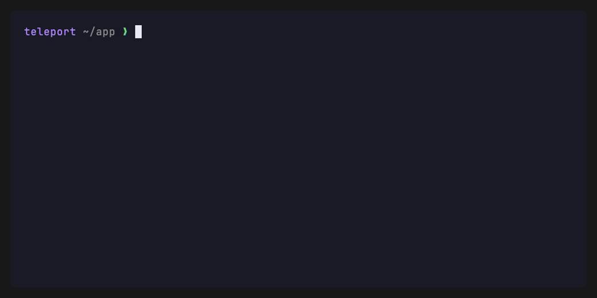

# teleport

CLI tool that syncs git-tracked files to a remote server via SSH/SFTP before
you commit — for developers who iterate on remote machines (staging servers,
VPS, homelab) and want to test live without polluting git history.

```
teleport init      # one-time profile setup (host + remote path)
teleport sync      # upload changed files → iterate → commit clean
```

<p align="center">
  
</p>

> The GIFs below are simulations recorded with [VHS](https://github.com/charmbracelet/vhs) —
> all hosts, paths, and files are invented (no real data). See [`demo/`](demo/) to regenerate them.

## How it works

1. `teleport init` — interactive TUI: pick an SSH host from `~/.ssh/config`,
   browse the remote filesystem, save a named profile.
2. Make local code changes.
3. `teleport sync` — uploads files changed since last commit (`git diff HEAD`)
   with a live progress bar. Add `-u` to include untracked files too.
4. Iterate until satisfied, then commit cleanly.

## Four ways to ship code

- **`sync`** — pushes your *working-tree* changes (everything modified since
  `HEAD`). Fast, dirty, throwaway: perfect for the edit-test-edit loop.
- **`beam`** — pushes *selected commits*, cherry-pick style. You pick which
  commits (and which files within them) land on the remote, and teleport
  remembers what was already sent per profile. Use it to promote reviewed,
  committed work to a server without pushing your whole branch.
- **`mirror`** — advances the remote's git branch to your local commits with the
  **same hash and message** (transfers git *objects*, not file contents). The
  remote ends clean at the new HEAD, its `git log` matching yours. Use it when
  the box runs from a git checkout and you want it in lockstep with local git.
- **`push`** — pushes *the paths you name*, exactly as given, **without asking
  git anything**. The escape hatch for build output and artifacts that
  `.gitignore` hides (`web/dist`, `target/release`, a `.env` the repo never
  tracks) — the only transfer command that can send them.

## Commands

| Command | Description |
|---|---|
| `teleport init` | Interactive profile setup (host picker → remote dir browser). `-p <name>` presets the profile name |
| `teleport sync [profile]` | Upload changed tracked files. `-u` also includes untracked files |
| `teleport beam [profile]` | Send selected local commits to the remote (cherry-pick style) |
| `teleport mirror [profile]` | Advance the remote branch to your local commits (same hash + message) via `git bundle`. `-a` to HEAD, `-c` clean first, `-f` force |
| `teleport run <action>... [profile]` | Run a profile's remote action(s), streaming their logs. `--list` shows them |
| `teleport actions add/list/edit/remove` | Manage a profile's remote actions (interactive wizard or flags) |
| `teleport status [profile]` | Compare local files against the remote by SHA256. `-p` checks only unpushed commits + dirty working tree |
| `teleport clean [profile]` | Discard dirty changes on the remote (`git checkout` + `git clean`). `-y` skips the prompt, `-x` also removes gitignored files |
| `teleport push <path>... [profile]` | Upload the given paths as-is, ignoring git entirely (the only way to send gitignored files). Files the remote already has are skipped; `-f` re-sends them. `--to` picks the destination, `-x` excludes, `--dry-run` previews |
| `teleport exclude [list\|add\|remove]` | Manage the paths `push` skips in this project (`.git` is skipped by default) |
| `teleport pull [profile]` | Download remote changes back to the local working tree |
| `teleport ship [bin]` | Deploy a local binary to its OS-matching bin profile |
| `teleport shell [profile]` | Open an interactive shell on the remote, already in the profile's path |
| `teleport profiles` | List configured profiles (`*` marks the local default) |
| `teleport profiles remove <name>` | Remove a profile from the global config |
| `teleport config get/set/unset <key>` | Manage per-directory defaults |
| `teleport version` | Print version, commit hash, and build date |

Most commands take an optional `[profile]` argument to override the local
default for that run. `-v`/`--verbose` works on every command.

### Root shorthands

For the common actions you don't need to type the subcommand:

| Shorthand | Equivalent |
|---|---|
| `teleport -s` | `teleport sync` |
| `teleport -su` | `teleport sync -u` |
| `teleport -i` | `teleport init` |
| `teleport -p` | `teleport profiles` |
| `teleport -b` | `teleport beam` |
| `teleport -ba` | `teleport beam --auto` |

The `beam` subcommand keeps its own flags (`--branch`, `--clean`,
`--then-sync`, `--yes`) — use the full `teleport beam …` form for those.

## Every command in action

<details>
<summary><b>init</b> — configure a profile (host picker → remote dir browser)</summary>
<p align="center"></p>
</details>

<details open>
<summary><b>sync</b> — upload working-tree changes with a live progress bar</summary>
<p align="center"></p>
</details>

<details>
<summary><b>status</b> — compare local files against the remote by SHA256</summary>
<p align="center"></p>
</details>

<details>
<summary><b>mirror</b> — advance the remote branch to your local commits (same hash)</summary>
<p align="center"></p>
</details>

<details>
<summary><b>clean</b> — discard dirty changes on the remote (with confirmation)</summary>
<p align="center"></p>
</details>

<details>
<summary><b>pull</b> — download remote changes back to the working tree</summary>
<p align="center"></p>
</details>

<details>
<summary><b>profiles</b> — list configured profiles (<code>*</code> marks the default)</summary>
<p align="center"></p>
</details>

<details>
<summary><b>config</b> — per-directory defaults and last-sync overview</summary>
<p align="center"></p>
</details>

<details>
<summary><b>version</b> / <b>--help</b></summary>
<p align="center"></p>
<p align="center"></p>
</details>

## Beam — send selected commits

`teleport beam` walks you from commits → files → upload:

<p align="center">
  
</p>

1. **Commit picker** — lists local commits ahead of the remote. Commits already
   beamed to this profile show a green sent badge (`󰗠`) and a dimmed subject;
   the picker opens with only the not-yet-sent commits pre-selected. `tab`
   toggles, `a` toggles all, `u` re-selects exactly the unsent set.
2. **File picker** — files from the selected commits, grouped and color-coded by
   commit (`󰆧 [shortSHA]`). Filter to one commit at a time with `←`/`→`. Before
   sending, preview any file in place: `v` opens the full file and `d` opens the
   diff that commit introduced, both in a `bat`-style pager with syntax
   highlighting (the diff is rendered delta-style — highlighted code with a
   two-column line-number gutter). Inside the viewer `tab` switches file ⇄ diff,
   `←`/`→` (or `n`/`p`) page to the previous/next file without leaving the viewer
   — keeping the current mode, so you can read every file's diff in sequence —
   with the position shown as `N/M`, `j/k`/`↑↓`/`ctrl+d`/`ctrl+u`/`g`/`G` scroll,
   and `esc` returns to the picker.
3. **Send view** — upload progress grouped by commit: each commit is a colored
   header with its short SHA and subject, its files listed underneath marked
   `✓` uploaded / `✗` failed / `·` pending.

teleport tracks "sent" **per destination profile** (a commit beamed to
`production` is still unsent for `staging`) and persists it in the per-project
local config. A commit counts as sent only when every path it touched uploaded
without error; SHAs that are no longer ahead of the remote (pushed, merged, or
rebased) are pruned automatically.

Useful flags:

```sh
teleport beam --auto        # -a: skip the commit picker, auto-select unsent commits
teleport beam --branch dev  # -b: beam commits from a branch other than the current one
teleport beam --clean       # -c: run clean on the remote before beaming
teleport beam --then-sync   # -s: after beaming, sync working-tree changes on top
teleport beam --yes         # -y: skip the clean confirmation prompt (use with -c)
teleport beam -cs           # clean remote → beam commits → sync working tree
```

## Mirror — reflect commits with the same hash

`teleport mirror` advances the remote's checked-out branch to your local commits
with an **identical hash and commit message**. Unlike `beam` (which copies file
*contents* over SFTP and leaves the remote working tree dirty), `mirror`
transfers the actual git *objects* via `git bundle`, so the remote's `git log`
matches yours exactly and its working tree ends clean at the new HEAD — the hash
is preserved by construction, not re-committed.

<p align="center">
  
</p>

The picker is **single-select** — you choose *how far to advance*. The reflected
range is always the contiguous span from the remote HEAD up to the commit you
pick, which is what guarantees the hash (a non-contiguous subset would need
rebasing — that's what `beam` is for). It advances **whatever branch the remote
has checked out**; you pick the destination branch once by checking it out
there, and teleport never switches branches for you. The branch *name* never
affects the hash — only ancestry decides fast-forward eligibility.

By default `mirror` only **fast-forwards** and never discards remote commits; a
diverged or dirty remote is refused unless you opt in:

```sh
teleport mirror              # pick how far to advance (target picker)
teleport mirror -a           # -a: advance all the way to HEAD, skip the picker
teleport mirror -b dev       # -b: mirror a branch other than the current one
teleport mirror -c           # -c: run clean on the remote first (dirty working tree)
teleport mirror -f           # -f: allow non-fast-forward — reset --hard (discards remote commits)
teleport mirror -y           # -y: skip the force/clean confirmation prompt
teleport mirror -cf          # clean + force-reset the remote to match local
```

A fresh remote repo (`git init` + `git checkout -b <branch>`, no commits) is
bootstrapped automatically with a full bundle. `mirror` keeps no per-profile
state — the remote HEAD is re-read every run as the source of truth.

| | `beam` | `mirror` |
|---|---|---|
| Transfers | file *contents* (SFTP) | git *objects* (bundle) |
| Remote git history | untouched | advances to the same SHAs |
| Same hash + message | — | **yes** |
| Remote working tree | left dirty (use `clean`) | left clean at the new HEAD |
| Non-contiguous subset | yes | no (would break the hash) |

## Ship — deploy a binary

`teleport ship [bin]` uploads a built binary to a remote `bin/` directory in
three steps (SFTP upload to `/tmp` → `chmod +x` → `mv` into place, with
automatic `sudo` escalation when needed). The target OS is auto-detected from
the binary's magic bytes (ELF → linux, Mach-O → macos, PE → windows).

Bin profiles (host, remote `bin/` path, optional remote name and source file)
are **per-project**: they live in this directory's local config, so different
repos can ship different binaries to different servers. A pre-0.10 global
`[bin_profiles]` section is deprecated — the first interactive `ship`/`init`
offers to migrate it into the project.

<p align="center">
  
</p>

```sh
teleport ship ./bin/mycli       # explicit binary
teleport ship                   # reads bin-dir; auto-picks the only file or prompts
teleport ship --os linux        # override OS detection
teleport ship --to ~/.local/bin # override the remote bin dir for this run
teleport ship --name mycli      # rename the binary on the remote
```

## Push — upload anything, git or not

`teleport push <local-path>... [profile]` uploads the paths you name **exactly as
given**. It never reads the git index or `.gitignore`, which makes it the only
transfer command that can send a build directory, a compiled asset bundle, or any
other artifact git deliberately hides.

```sh
teleport push web/dist                          # → <profile path>/web/dist
teleport push web/dist --to web/dist.new        # one path: --to is the exact destination
teleport push a.env b.env --to config           # many paths: --to is a directory
teleport push web/dist --to dist.new --then swap  # upload, then swap it in
teleport push web/dist --dry-run                # print the plan, connect to nothing
teleport push web/dist -f                       # re-send everything, unchanged included
```

### How it differs from `sync` and `ship`

This is the exact point where it's easy to reach for the wrong command, so, in
writing:

| | Reads `.gitignore` | Accepts | Notes |
|---|---|---|---|
| `sync` | **Yes** — an ignored path is skipped **silently** and the run still reports success | git-tracked files (`-u` adds untracked, but *still not ignored ones*) | The git-aware command. Its semantics are deliberate and are not changing |
| `push` | **No** — uploads precisely what you name | any file or directory | The explicit escape hatch |
| `ship` | n/a | **executables only** — validates ELF/Mach-O/PE magic and rejects anything else | A binary channel that verifies it got a binary |

If `sync -u` seemed to "lose" a file, it was gitignored. That is what `push` is
for.

### Excluding paths

```sh
teleport exclude                       # browse the project tree and pick what to skip
teleport exclude list                  # the effective set, and where each entry comes from
teleport exclude add node_modules '*.log'
teleport exclude remove '*.log'
```

The picker walks the tree: `→` enters a folder, `←` goes back up, `tab` marks the
entry under the cursor, `enter` saves. A nested pick is stored anchored to that one
place (`web/node_modules`), a top-level pick as a bare name that matches anywhere.
Patterns it never showed — a glob like `*.log`, or entries in folders you did not
open — are left alone, so the picker and `add`/`remove` can be mixed freely.

The list lives in the **project's** local config (`push_exclude` in
`~/.config/teleport/projects/<hash>.toml`), so it follows the working directory the
way the sync profile does. `--exclude` adds to it for one run; `--no-exclude`
ignores everything, defaults included.

### Rules

- **The profile is the boundary.** `--to` is always relative to the profile's
  remote `path`; absolute values are rejected, and so is anything that would
  escape the profile directory via `..`. `push` cannot write elsewhere on the box.
- **Without `--to`**, the destination mirrors the path relative to your current
  directory: `push web/dist` from the repo root lands at `<path>/web/dist`.
- **Directories are recursive**, and every directory in the tree (empty ones
  included) is created on the remote.
- **`.git` is excluded by default**, along with this project's saved list and any
  `-x`/`--exclude` globs. A pattern without a slash matches a base name at any
  depth (`-x node_modules`, `-x '*.log'`); one with a slash matches the path as you
  named it (`-x 'base/*.deb'`). A matching directory is pruned, never walked.
  `--no-exclude` sends everything, `.git` included. Naming an excluded path
  directly is an error rather than a silent no-op.
- **No deletion.** There is no rsync-style `--delete` — removing files remotely is
  a different class of risk. For a clean replace, push to a new directory and swap
  it in an action: `push dist --to dist.new --then swap`.
- **Symlinks are followed** and their content uploaded. A broken symlink or a
  symlink cycle is a loud error, and it aborts the run *before* anything uploads.
- **Only the exec bit is preserved** (`0755` if the local file is executable,
  `0644` otherwise). No unconditional `chmod +x` — that's `ship`'s job.
- **Files the remote already has are skipped**, and deciding that is cheap. Each
  run asks the cheapest question that can settle a file: one batched remote
  `stat` first, so a missing file or a different size needs no hash at all; then a
  local cache, so a destination already proven identical — same size and mtime on
  both ends since it was verified — is skipped without reading a byte. Only what
  is still ambiguous is hashed, and that hash is computed **on the server** (one
  batched command, so digests cross the network, never contents). A second push of
  an unchanged tree therefore costs one `stat` command, and a large artifact that
  did not change is neither resent nor re-read. Skipped files are listed with a
  `↷`, and `-v` logs why each file is sent or skipped. `-f`/`--force` skips every
  check and uploads everything.
- **Every upload is size-verified** (a truncated transfer fails). `--checksum`
  additionally compares SHA256 on both ends after writing, and makes the skip
  decision hash instead of trusting the cache — the escape hatch for a file edited
  in place without its size or mtime changing.
- **`last sync` is not touched.** That timestamp tracks git parity with the
  remote; `push` says nothing about git.

Headless: `--json` prints one result object (`sent`, `skipped`, `excluded`, `bytes`,
`verified`, `files[]` — each entry flagged `skipped` when it was already on the
remote — plus nested `actions[]` when `--then` is used) and `--dry-run` exits
`0` without opening a connection. Because a dry run connects to nothing, it
cannot know what the remote already has: it lists the whole plan, and the real
run is what skips.

## Shell — jump onto the remote

`teleport shell [profile]` drops you into an interactive shell on the remote,
already `cd`'d into the profile's remote path — handy when you need to tail logs
or restart a service on the box you've been syncing to. No extra setup: it
reuses the host and path from the sync profile.

<p align="center">
  
</p>

```sh
teleport shell           # uses the local default profile
teleport shell staging   # use a specific profile
```

It runs `ssh -t <host> "cd <path> && exec <shell>"` and **replaces its own
process** with the system `ssh` binary, so the session behaves and performs
exactly like a hand-typed `ssh` (native TTY, colors, agent, `~/.ssh/config`) and
no teleport process lingers while you're connected. The host is resolved by
`ssh` itself from `~/.ssh/config`. The remote shell is the first of `zsh`,
`bash`, `sh` that exists on the box, so a server without `zsh` still drops you
into a shell; if none of the three is installed you get
`teleport: no shell found on the remote` and exit code 127.

## Actions — automate remote processes

An **action** is a named sequence of remote commands attached to a profile —
`deploy`, `restart`, `logs`, whatever your box needs after a push. Actions run
over SSH on the profile's host and are **not tied to the profile's directory**:
each one declares its own working directory (or none, for commands like
`systemctl`). The output of each step is **streamed back line by line** so you
watch the process live.

Define one with the interactive wizard (name → steps → working directory via the
remote dir browser → options → "test now, then save"):

```sh
teleport actions add            # wizard on the default profile
teleport actions list           # show the profile's actions
teleport actions edit deploy    # re-open the wizard, pre-filled
teleport actions remove deploy
```

Or headless, naming the action with `--name` (the positional is the profile):

```sh
teleport actions add staging --no-input --name doctor \
  --run "uname -m" --run "df -h ." --timeout 2m
```

Or write them straight into `~/.config/teleport/config.toml`:

```toml
[profiles.staging.actions.deploy]
run = [
  "composer install --no-dev",
  "php artisan migrate --force",
  "sudo systemctl restart app.service",
]
cwd = "/var/www/app"   # optional; defaults to the profile path; "" = no cd
timeout = "5m"         # optional; per step; default 10m
confirm = true         # optional; prompt before running
```

Run them standalone, or chain them after a transfer with `--then`/`-t` (they
run only if the transfer succeeded, over the same connection):

```sh
teleport run deploy                     # stream the logs live
teleport run deploy logs staging        # several actions, explicit profile
teleport sync --then deploy             # sync, then deploy
teleport mirror -a --then deploy --then logs   # mirror, then deploy, then tail
```

The first step that exits non-zero aborts the action (and the chain). Under
`--json` the logs go to stderr and the result nests an `actions` array; headless,
an action with `confirm = true` needs `-y` or it fails closed (exit `2`).

## Reading the output

A command tells you what it is doing as one chronological stream. Phases carry a
`▸`, files carry their own marker, and nothing is silent:

```
  ▸ scan      13 file(s) · 275.4 MB · 1 excluded                   0.3s
  ▸ connect   example:/srv/app                                     0.4s
  ▸ compare   stat 13 · cache 10 · hash 3                          2.1s
  ↷ base/entrypoint.sh
  ▸ upload    3 file(s) · 275.1 MB
  ✓ base/odoo_19.0+e.20260824_all.deb
  [=====================================]  3/3  100%  00:12
  ✓ pushed 3 file(s) · 275.1 MB · verified (size) · skipped 10      14.9s
```

The phase names are shared across the transfer commands — `scan`, `connect`,
`compare`, `upload`, then the actions — so the same work reads the same way
everywhere. A running phase rewrites its own line, which is how a long `compare`
over a large artifact shows `hashing 2/13` instead of looking hung.

The transfer view below them is a **fixed eight rows** of recent files plus the
bar, not a full-height pane: it scrolls the terminal by its own height and no
more, so the phases above stay where you can read them.

Under `--json`, or with no TTY, the same stream becomes `[push] phase: detail`
lines on stderr. `-v` adds the per-file decisions (`cache hit`, `size differs`,
`content differs`) and switches the phases to one line each, since a live line
cannot share the terminal with log output. `-q` leaves only the result.

## Scripting (headless)

Every command runs without a terminal, for CI and deploy pipelines. Three
persistent flags:

- `--no-input` — never prompt; resolve from flags or **fail closed** (exit `2`)
  with a message naming the flag that was missing, instead of hanging on a
  picker or confirmation. It's also implied automatically when stdin isn't a TTY.
- `--json` — print a single JSON result object to stdout (drift, files sent,
  mirror summary…) and route all decoration to stderr, so callers parse instead
  of scraping ANSI. The object carries `phases` with each phase's duration in
  seconds, so a slow pipeline step is attributable.
- `-q`/`--quiet` — print only the final result and errors, dropping the phase
  log. A failed phase is still named: a silenced command must say where it died.

```sh
teleport status --json          # {"target":…,"in_sync":false,"total":146,"drift":[…]}
teleport beam -a --no-input     # send unsent commits, no picker (exit 2 if -a is missing)
teleport mirror -a --no-input   # advance the remote to HEAD, unattended
teleport clean --no-input       # --no-input implies -y; never discards without an explicit opt-in
teleport mirror -a --then deploy --no-input --json   # mirror + run 'deploy', logs on stderr
teleport push web/dist --to dist.new --then swap --no-input --json   # upload a build, then swap it
```

Exit codes: `0` success / in sync · `1` execution error, or drift detected by
`status` · `2` a selection or confirmation couldn't be resolved from flags
without a TTY.

## Installation

**Requirements:** Go 1.25+, a terminal with a [Nerd Font](https://www.nerdfonts.com/) installed.

```sh
git clone https://github.com/Cerebellum-ITM/teleport
cd teleport
make build       # builds ./bin/teleport and copies to ~/.local/bin
```

For cross-platform release binaries:

```sh
make build_release   # darwin_arm64, darwin_amd64, linux_amd64, linux_arm64 → ./bin/
```

## SSH authentication

Teleport reads `~/.ssh/config` for host resolution (Hostname, User, Port).
Authentication uses ssh-agent (`SSH_AUTH_SOCK`) when available, otherwise falls
back to default key files (`id_ed25519`, `id_rsa`, `id_ecdsa`). When
`IdentityFile` is set in `~/.ssh/config`, only that key is offered to avoid
exhausting `MaxAuthTries`.

If no agent is running and no key file is found, teleport falls back to a masked
password prompt — every command that connects to a remote will ask for the SSH
password instead of aborting.

## Configuration

- Global profiles: `~/.config/teleport/config.toml`
- Local project default: `~/.config/teleport/projects/<sha256-of-cwd>.toml`

No config files are placed inside your project directories.

Per-directory defaults (managed with `teleport config`):

| Key | Type | Default | Meaning |
|---|---|---|---|
| `default-profile` | string | — | Profile used when none is passed |
| `sync-untracked` | bool | `false` | Include untracked files on every sync (same as `-u`) |
| `bin-dir` | string | `<unset>` | Local dir where built binaries live (used by `teleport ship`) |

```sh
teleport config set sync-untracked true   # remember -u for this directory
teleport config get                        # print all local config values
teleport config unset bin-dir              # reset a key to its default
```

## Tech stack

Built with the [Charm](https://charm.sh/) v2 TUI stack:
[Bubbletea](https://github.com/charmbracelet/bubbletea) ·
[Bubbles](https://github.com/charmbracelet/bubbles) ·
[Lipgloss](https://github.com/charmbracelet/lipgloss) ·
[Huh](https://github.com/charmbracelet/huh) · SFTP via
[pkg/sftp](https://github.com/pkg/sftp).
